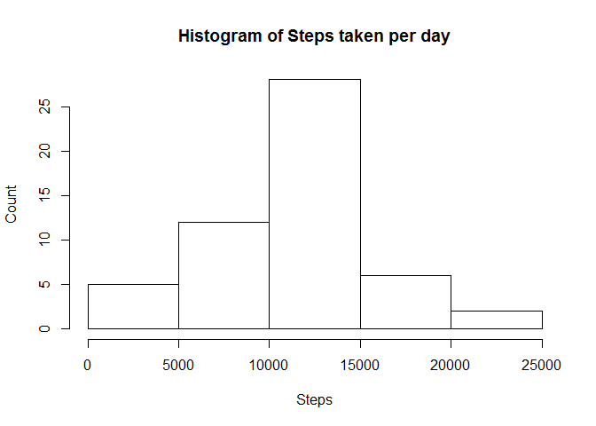
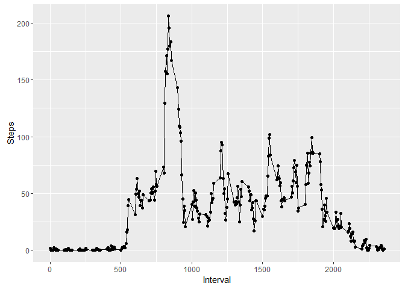
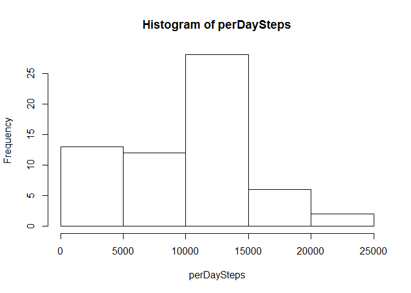
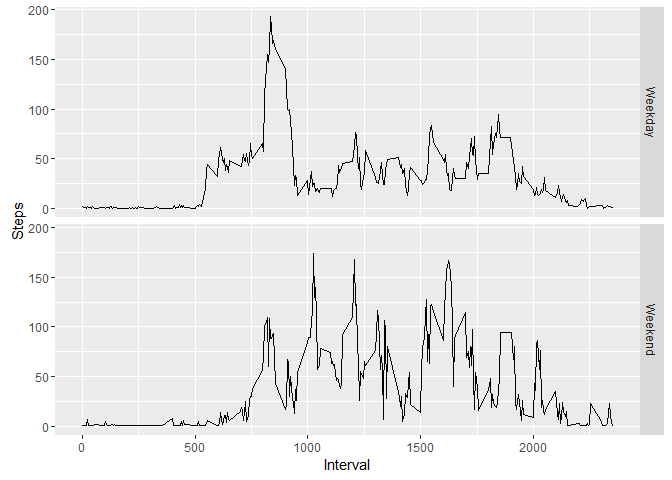

# Reproducible Research: Peer Assessment 1


## Loading and preprocessing the data
So lets start by loading up our date


```r
data <- read.csv("activity/activity.csv")
```
We want to then group the number of steps by the whole day for use in future sections

```r
perDaySteps <- tapply(data$steps, data$date, sum)
```


## What is mean total number of steps taken per day?
lets take a look at a histogram of the total number of steps per day

```r
hist(perDaySteps, xlab="Steps", ylab="Count", main="Histogram of Steps taken per day")
```

<!-- -->

Lets take a look at what that shows for the median and mean

```r
median(perDaySteps, na.rm=T)
```

```
## [1] 10765
```

```r
mean(perDaySteps, na.rm=T)
```

```
## [1] 10766.19
```

Time series plot of average number of steps taken


## What is the average daily activity pattern?
To get an activity pattern, we are required now to group by the interval of the day. 

```r
averageIntervalValue <- tapply(data$steps, data$interval, mean, na.rm=T)
```

Now we can graph this over the course of a day


```r
library(ggplot2)
qplot(x=unique(data$interval), y=averageIntervalValue) + geom_line() + labs(x="Interval", y="Steps", main="Number of steps on average per time interval")
```

<!-- -->

Which 5 minute period on average has the max number of steps though?

```r
max(averageIntervalValue)
```

```
## [1] 206.1698
```

Which comes from


```r
periodOfDay <- as.integer(names(which.max(averageIntervalValue)))
strftime(strptime("0:0:0", "%H:%M:%S") + periodOfDay/100*60*60, format="%H:%M:%S")
```

```
## [1] "08:21:00"
```

## Imputing missing values
There are a number of missing values in this dataset. The sum of which is

```r
sum(is.na(data$steps))
```

```
## [1] 2304
```

To replace these values, I will use the mean for that time period over the rest of the data. Lets now fill that data in to a new dataset


```r
fillData <- data
fillData$steps[is.na(fillData$steps)] <- averageIntervalValue[as.character(fillData$interval)][[1]]
perDaySteps <- tapply(fillData$steps, fillData$date, sum)
```

Lets look at that histogram

```r
hist(perDaySteps)
```

<!-- -->

And the mean and median

```r
mean(perDaySteps)
```

```
## [1] 9419.081
```

```r
median(perDaySteps)
```

```
## [1] 10395
```

## Are there differences in activity patterns between weekdays and weekends?
So first we'll need to convert out date into an actual date. Then get the week day from that.


```r
dayType <- factor(c("Weekday", "Weekend"))
fillData$posixDate <- as.Date(fillData$date, format="%Y-%m-%d")
fillData$weekday <- weekdays(fillData$posixDate)

fillData$isWeekend <- fillData$weekday %in% c("Satuday", "Sunday")
fillData$dayType <- as.factor(ifelse(fillData$isWeekend, "Weekend", "Weekday"))

weekendAve <- tapply(fillData$steps[fillData$isWeekend], fillData$interval[fillData$isWeekend], mean, na.rm=T)
weekdayAve <- tapply(fillData$steps[!fillData$isWeekend], fillData$interval[!fillData$isWeekend], mean, na.rm=T)

fillData$dayTypeAverage <- ifelse(fillData$isWeekend,
                                  weekendAve[as.character(fillData$interval)],
                                  weekdayAve[as.character(fillData$interval)]
                                  )

ggplot(fillData, aes(interval, dayTypeAverage))  + facet_grid(dayType~.) + geom_line() + labs(x="Interval", y="Steps")
```

<!-- -->
